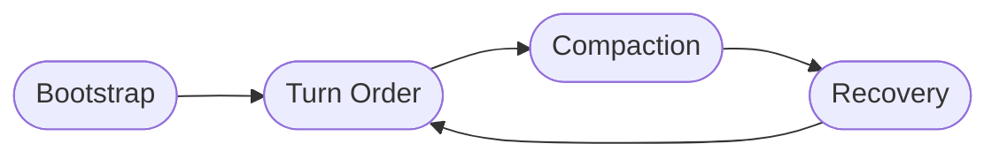

# ttrpg-runner

A friendly companion for running tabletop RPG sessions inside
[Hermes](https://hermes-agent.nousresearch.com). Pick a setting, roll
some dice, tell a story. ttrpg-runner keeps the scene, the cast, and
the dice rolls organized for you so the fiction stays in the front of
the table.

## What you get

- **A bootstrap skill** that walks you through setting up a new game,
  creating a character, and opening the first scene.
- **A core rulebook** of always-on conventions: how messages are
  formatted in chat, whose turn it is, and how dice get rolled into
  the story.
- **Five ready-to-play content packs**, each one a first-class
  setting with its own tone, rules, and adventure seeds:

  - **Cyberpunk** — Night City-style chrome, netrunning, and edgerunning.
  - **DND** — Classic high-fantasy adventuring, dice and spell slots.
  - **Mistborn** — Brandon Sanderson's allomancy, with separate
    reference material for the Final Empire era and the industrial
    era that follows.
  - **Pokemon** — Trainer-and-partner journeys with reaction-based
    combat and bond-level progression.
  - **Expanse** — Hard sci-fi belter politics, engineering readouts,
    and jump calculations.

- **A dice roller** that supports any standard expression
  (`1d20+5`, `3d6`, `4d8-2`) with optional seeding for auditable rolls.

## How a session flows

Every session moves through the same four phases. Your story files on
disk are the source of truth, so the fiction survives every
context-compression cycle Hermes performs.



- **Bootstrap** — the player and the GM agree on the setting, the
  core rules are loaded, the session folder is created, and a
  character is built.
- **Turn Order** — the GM narrates a scene, the player acts, dice
  resolve risky moments, and the results are written into the
  session's story files.
- **Compaction** — when the conversation grows long, Hermes
  automatically compresses the working context. Because the
  campaign's truth lives on disk, nothing important is lost.
- **Recovery** — the next turn picks up from the data files
  (story, timeline, characters, locations, events, dice rolls) and
  play continues seamlessly.

## What's in a session folder

Each campaign is its own folder. Nothing from one session ever leaks
into another.

```
sessions/<your-session>/
  story.md        running fiction and the campaign header
  timeline.md     beat-by-beat chronology
  secrets.md      GM-only truths, twists, and behind-the-screen planning
  characters/     markdown dossiers for the cast
  locations/      markdown dossiers for places
  events/         markdown dossiers for missions and turning points
  rolls/          JSON audit trail for important dice
```

## Single setting or crossover

By default a session is single-setting: pick one content pack and
play. If the player explicitly names a crossover of two native
packs (for example, *Cyberpunk + Pokemon*), the GM loads both
packs' rulebooks and runs the session as a native crossover.
Anything outside the five native packs still works in a
reduced-feature generic mode — no native references, but the
session, dice, and core rules are all available.

## What it doesn't do

- It does not pull pre-written quest or NPC libraries. Every story
  ingredient is authored fresh for your table.
- It does not maintain a JSON state mirror. The markdown files
  in the session folder are the only authoritative memory.
- It does not pre-load content. Packs and the core rules are
  loaded on demand when a session starts and when the player
  asks for a setting switch.
